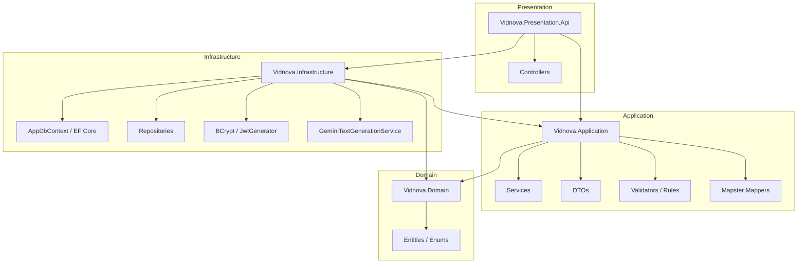
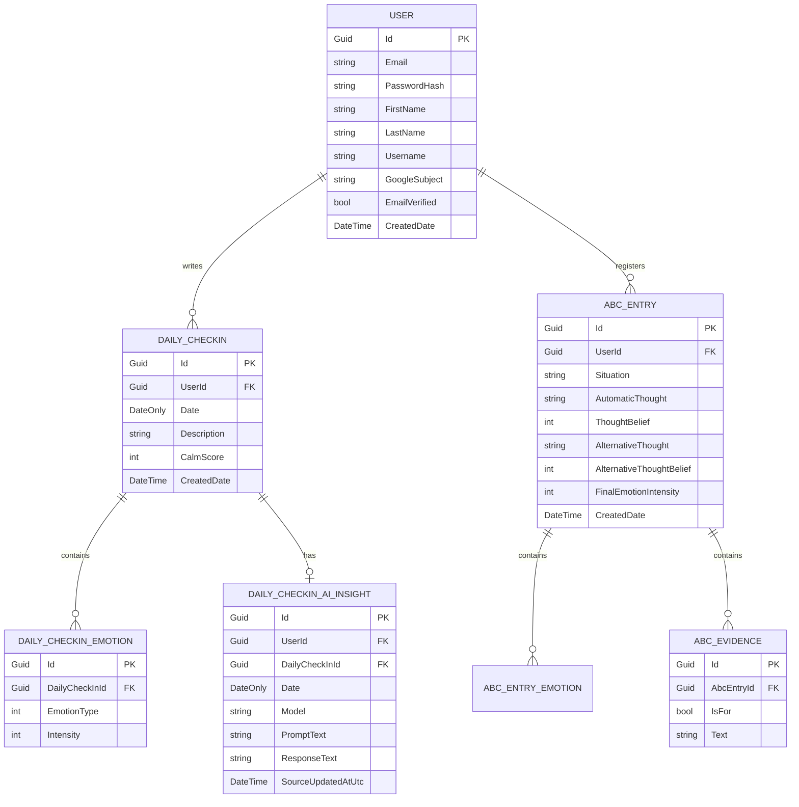

# 🌿 Vidnova (Віднова) — Платформа для підтримки ментального здоров'я

**Vidnova** — це сучасний кросплатформний програмний комплекс (мобільний додаток та веб-інтерфейс API), розроблений для підтримки психологічного стану користувачів за допомогою інструментів **Когнітивно-поведінкової терапії (КПТ)** та інтеграції штучного інтелекту.

Проект допомагає користувачам проводити щоденний моніторинг свого емоційного стану, відстежувати рівень спокою, виявляти деструктивні автоматичні думки та проводити їх реструктуризацію за допомогою структурованого журналу за методом ABC.

---

## 📖 Зміст
1. [Про проблематику та концепцію проекту](#-про-проблематику-та-концепцію-проекту)
2. [Функціональні можливості (Features)](#-функциональні-можливості-features)
3. [Технологічний стек (Technology Stack)](#-технологічний-стек-technology-stack)
4. [Архітектура системи (System Architecture)](#-архітектура-системи-system-architecture)
5. [База даних та Ентиті-моделі](#-база-даних-та-ентиті-моделі)
6. [Інтеграція з AI (Gemini)](#-інтеграція-з-ai-gemini)
7. [Налаштування та запуск проекту (Setup & Run)](#-налаштування-та-запуск-проекту-setup--run)

---

## 🧠 Про проблематику та концепцію проекту

У сучасному світі люди постійно стикаються зі стресом, тривогою та емоційним вигоранням. Часто емоції переповнюють нас через спотворення в думках, які в КПТ називаються *автоматичними думками*. Без належної рефлексії ці думки призводять до погіршення психологічного самопочуття.

**Vidnova** пропонує практичний і доступний цифровий інструмент для самодопомоги:
* **Чек-ін стану:** Швидка фіксація емоційного фону протягом дня.
* **Метод ABC (CBT Journal):** Покроковий інструмент для деконструкції стресових ситуацій. Користувач фіксує подію (Activating Event), записує автоматичну думку (Belief), шукає аргументи «ЗА» і «ПРОТИ», формує раціональну альтернативу й оцінює свій стан після цього.
* **Розумний емпатичний фідбек:** Використання великих мовних моделей штучного інтелекту для надання екологічної підтримки та рекомендацій щодо заземлення.

---

## 🚀 Функціональні можливості (Features)

### 1. Авторизація та безпека (Authentication & Security)
* **Класична реєстрація та логін:** З перевіркою паролів (мінімум 8 символів, хешування через `BCrypt`).
* **Google OAuth 2.0:** Швидкий вхід за допомогою акаунту Google. Забезпечується автоматичне створення профілю на основі даних Google Token Payload.
* **Гнучке керування акаунтом:**
  * Зміна електронної пошти.
  * Зміна поточного пароля.
  * Встановлення нового пароля для акаунтів, створених через Google-only аутентифікацію.

### 2. Щоденні чек-іни (Daily Check-ins)
* Оцінка загального рівня спокою (Calm Score) за шкалою від 0 до 100%.
* Вибір емоцій та визначення їх інтенсивності.
* Додавання текстового опису дня (до 1500 символів).
* **Правила сумісності емоцій (Emotion Rules):** На рівні бізнес-логіки бекенду впроваджено валідацію сумісності. Наприклад, позитивні емоції (*Радість*, *Спокій*) не можуть бути збережені в одному чек-іні разом із негативними (*Сум*, *Тривога*, *Злість*, *Стрес* тощо).

### 3. Розумна підтримка AI (Empathetic AI Insights)
* На основі текстового опису дня, домінуючої емоції та рівня спокою система генерує підтримуючий аналітичний висновок (Insight).
* Використовується модель **Google Gemini** з оптимізованим системним промптом українською мовою.
* Логіка генерації адаптується під рівень спокою користувача:
  * **0-20% (Критично):** Валідація болю + дихальні техніки або заземлення.
  * **21-40% (Складно):** Рекомендації з когнітивного дистанціювання.
  * **41-60% (Стабільно):** Поведінкова активація (прогулянка, відпочинок).
  * **61-80% (Добре):** Підкріплення ресурсного стану.
  * **81-100% (Чудово):** Фокус на аналізі факторів успіху.
* **Модельне кешування:** AI Insight зберігається в БД. Повторна генерація відбувається лише у випадку, якщо користувач відредагував свій чек-ін.

### 4. Журнал КПТ (ABC Thought Diary Wizard)
* Інтерактивний 5-кроковий майстер (Wizard) для проходження реструктуризації думок:
  1. **Ситуація:** Опис факту (що відбулося).
  2. **Думки:** Виявлення автоматичної думки та оцінка віри в неї (0-100%).
  3. **Докази:** Запис фактів «ЗА» та «ПРОТИ» цієї думки (до 50 пунктів).
  4. **Переосмислення:** Формулювання альтернативної думки та оцінка віри в неї.
  5. **Результат:** Фіксація кінцевого емоційного стану для порівняння.

### 5. Аналітика та Прогрес (Visual Insights)
* **Календар станів:** Колірна інтерактивна сітка днів відповідно до самопочуття користувача.
* **Статистичні графіки (FlChart):**
  * Динаміка середнього рівня спокою за обраний період.
  * Порівняння інтенсивності емоцій до та після проходження журналу ABC.
  * Діаграма частоти виникнення різних емоцій.

---

## 🛠 Технологічний стек (Technology Stack)

### Бекенд (vidnova_backend)
* **Платформа:** .NET 8 (C# 12)
* **Веб-фреймворк:** ASP.NET Core Web API
* **Доступ до даних:** Entity Framework Core 8 (Code First)
* **База даних:** MS SQL Server (локально або через Docker-контейнер)
* **Безпека:** JWT Bearer Authentication, BCrypt.Net-Next (хешування паролів), Google.Apis.Auth
* **Інтеграція AI:** REST-інтеграція з Google Gemini API (HttpClient, System.Text.Json)
* **Мапінг:** Mapster (швидкий та оптимізований мапінг DTO на сутності)
* **Валідація:** Власні правила валідації сумісності емоцій та обмежень на базі бізнес-моделі

### Фронтенд (vidnova_frontend)
* **Фреймворк:** Flutter SDK (Dart)
* **Управління станом:** Flutter BLoC (Cubit) для розділення бізнес-логіки та UI
* **Мережеві запити:** Dio (з кастомними інтерцепторами для автоматичного додавання Bearer-токенів)
* **Локальне збереження:** Flutter Secure Storage (безпечне збереження JWT токена на пристрої)
* **Візуалізація даних:** FlChart (гнучкі інтерактивні графіки)
* **Анімації та інтерфейс:** Twemoji (емодзі), Google Fonts, власні кастомні анімовані компоненти та переходи

---

## 📐 Архітектура системи (System Architecture)

Проект розроблений за принципами **Clean Architecture** (Чистої архітектури) та розділений на чіткі рівні:



### Рівні Clean Architecture на бекенді:
1. **Vidnova.Domain:** Базовий рівень. Містить чисті сутності (`User`, `DailyCheckIn`, `AbcEntry`), переліки (`EmotionType`) та базові моделі без зовнішніх залежностей.
2. **Vidnova.Application:** Містить інтерфейси сервісів, DTO, бізнес-логіку додатку, правила валідації (`EmotionRules`) та конфігурацію Mapster.
3. **Vidnova.Infrastructure:** Реалізує технічні деталі: доступ до БД (EF Core, Unit of Work, репозиторії), інтеграцію з Gemini API, генерацію JWT, перевірку Google ID токенів.
4. **Vidnova.Presentation.Api:** Точка входу (ASP.NET Core Web API). Налаштування DI, Swagger, JWT Bearer Middleware, обробка CORS та контролери API.

---

## 🗄 База даних та Ентиті-моделі

Зв'язки між основними сутностями в базі даних MS SQL Server:



---

## 🤖 Інтеграція з AI (Gemini)

Бекенд використовує сервіс `GeminiTextGenerationService`, що виконує HTTP-запити до офіційного REST API Google. Сервіс має важливу особливість — **механізм автоматичного виявлення та перемикання моделей (Model Discovery & Fallback)**:
1. Спочатку робиться спроба використати модель, вказану в конфігурації (наприклад, `gemini-flash-lite-latest`).
2. У разі виникнення помилки `404 Not Found` (якщо обрана модель недоступна для поточного API-ключа), сервіс виконує запит до ендпоінту `listModels`.
3. Система фільтрує моделі, що підтримують метод `generateContent`, сортує їх за пріоритетністю (від найлегших та найдешевших моделей лінійки Flash Lite до Flash) і автоматично виконує повторний запит із робочою моделлю.

---

## ⚙️ Налаштування та запуск проекту (Setup & Run)

### Передумови:
* Установлений **.NET 8 SDK**
* Установлений **Flutter SDK (>= 3.9.2)**
* Локальний **MS SQL Server** або запущений Docker

### Крок 1: Запуск бази даних через Docker
У корені проекту знаходиться файл `docker-compose.yml`. Ви можете підняти базу даних однією командою:
```bash
docker-compose up -d
```

### Крок 2: Конфігурація середовища
Створіть файл `.env` у корені проекту на основі `.env.example`:
```env
DB_SERVER=localhost
DB_PORT=1433
DB_NAME=VidnovaDb
DB_USER=sa
DB_PASSWORD=YourStrongSecurePassword123!

Jwt__Issuer=VidnovaApi
Jwt__Audience=VidnovaApp
Jwt__SigningKey=your_very_long_secure_signing_key_at_least_32_chars_long
Jwt__AccessTokenMinutes=1440

GoogleAuth__ClientId=your_google_client_id.apps.googleusercontent.com

Gemini__ApiKey=your_gemini_api_key
Gemini__Model=gemini-flash-lite-latest
```

### Крок 3: Запуск Бекенду
1. Перейдіть до папки презентаційного шару API:
   ```bash
   cd vidnova_backend/Vidnova.Presentation.Api
   ```
2. Виконайте міграції EF Core для створення структури БД:
   ```bash
   dotnet ef database update
   ```
3. Запустіть веб-сервер API:
   ```bash
   dotnet run
   ```
   API буде доступно за адресою: `http://localhost:5080`. Документація Swagger відкриється автоматично за посиланням `http://localhost:5080/swagger`.

### Крок 4: Запуск Мобільного додатку (Flutter)
1. Перейдіть до папки фронтенду:
   ```bash
   cd vidnova_frontend
   ```
2. Отримайте необхідні пакети:
   ```bash
   flutter pub get
   ```
3. Запустіть додаток на емуляторі або фізичному пристрої:
   ```bash
   flutter run
   ```
   *Примітка:* Якщо ви запускаєте додаток на Android емуляторі, Dio автоматично перенаправлятиме запити на локальну адресу `http://10.0.2.2:5080`.